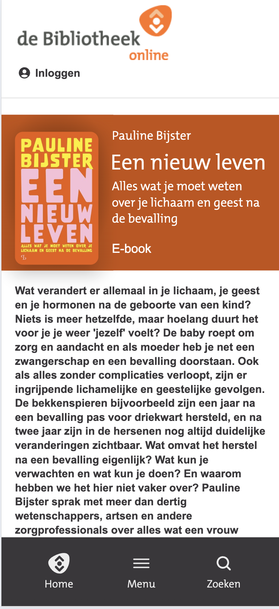
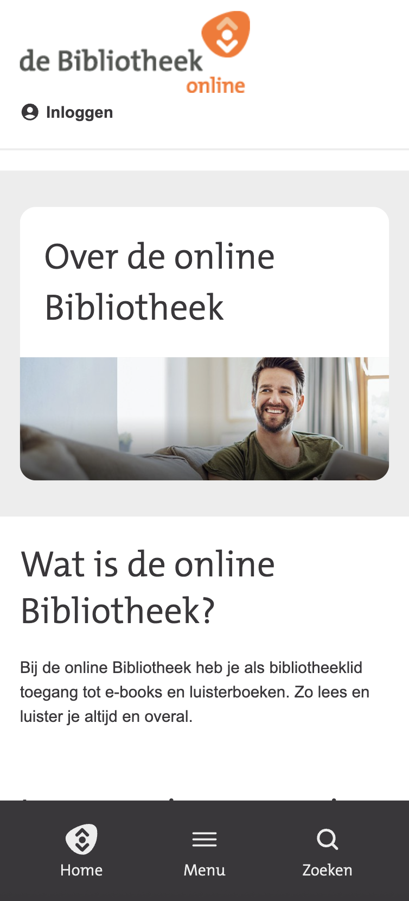
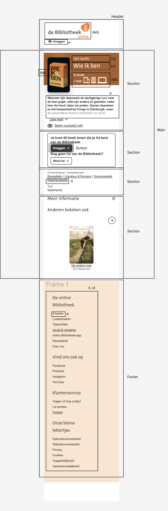
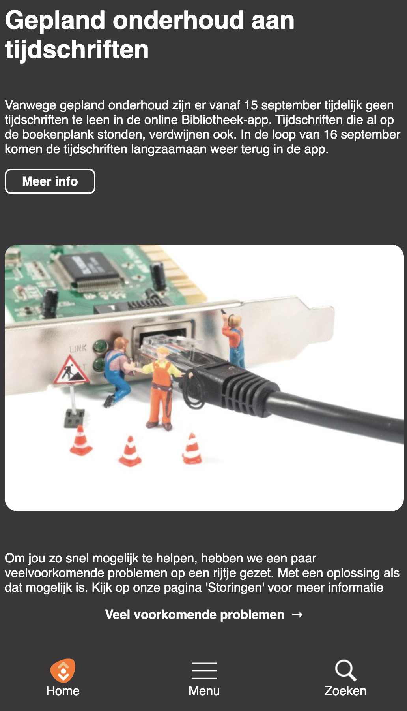
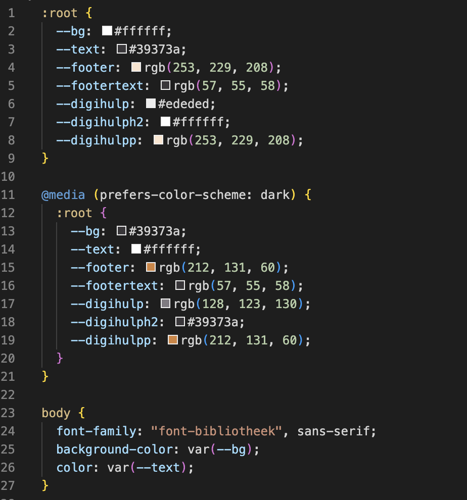
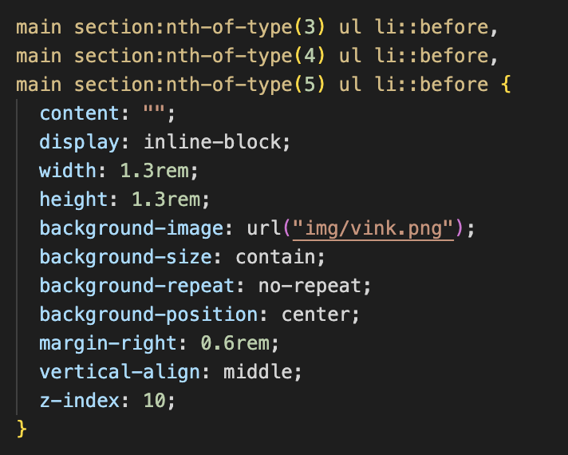
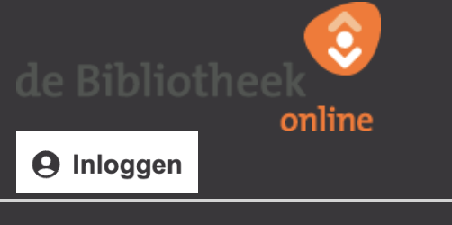

# Procesverslag

Markdown is een simpele manier om HTML te schrijven.  
Markdown cheat cheet: [Hulp bij het schrijven van Markdown](https://github.com/adam-p/markdown-here/wiki/Markdown-Cheatsheet).

Nb. De standaardstructuur en de spartaanse opmaak van de README.md zijn helemaal prima. Het gaat om de inhoud van je procesverslag. Besteedt de tijd voor pracht en praal aan je website.

Nb. Door _open_ toe te voegen aan een _details_ element kun je deze standaard open zetten. Fijn om dat steeds voor de relevante stuk(ken) te doen.

## Jij

  
uitwerken voor kick-off werkgroep

### Auteur:

Persijn van der Jagt

#### Je startniveau:

Rood

#### Je focus:

Bling-bling

## Je website

  
uitwerken voor kick-off werkgroep

### Je opdracht:

onlinebibliotheek.nl

#### Screenshot(s) van de eerste pagina (small screen):

Homepagina

#### Screenshot(s) van de tweede pagina (small screen):

Detailpagina

## Toegankelijkheidstest 1/2 (week 1)

  
uitwerken na test in 2e werkgroep

### Bevindingen

- Lijst met je bevindingen die in de test naar voren kwamen:
- Er wordt geen footer gebruikt
- Veel div'jes
- Geen H1 te vinden op de pagina, ze gaan direct naar H2
- Geen alt text bij de img van covers van boeken
- Geen video en audio op de website
- Geen darkmode
- Geen animaties
- Contrast is goed

## Breakdownschets (week 1)

  
uitwerken na afloop 3e werkgroep

### de hele pagina:

  

### dynamisch deel (bijv menu):

  

### wellicht nog een dynamisch deel (bijv filter):

  

## Voortgang 1 (week 2)

  
uitwerken voor 1e voortgang

### Stand van zaken

hier dit ging goed & dit was lastig (neem ook screenshots op van delen van je website en code)

### Agenda voor meeting

samen met je groepje opstellen

| student 1      | student 2          | student 3    | student 4        |
| -------------- | ------------------ | ------------ | ---------------- |
| dit bespreken  | en dit             | en ik dit    | en dan ik dat    |
| en dat ook nog | dit als er tijd is | nog een punt | dit wil ik zeker |
| ...            | ...                | ...          | ...              |

Dit hebben wij niet gedaan met ons groepje

### Verslag van meeting

hier na afloop snel de uitkomsten van de meeting vastleggen

- Goed op weg.
- H2'tjes verkeerd gebruikt maar kan nog beter

## Voortgang 2 (week 3)

  
uitwerken voor 2e voortgang

### Stand van zaken

Goed op weg met mijn code, loop op dit moment nergens tegen aan.

### Agenda voor meeting

samen met je groepje opstellen

| student 1      | student 2          | student 3    | student 4        |
| -------------- | ------------------ | ------------ | ---------------- |
| dit bespreken  | en dit             | en ik dit    | en dan ik dat    |
| en dat ook nog | dit als er tijd is | nog een punt | dit wil ik zeker |
| ...            | ...                | ...          | ...              |

Dit hebben wij niet gedaan met mijn groepje.

### Verslag van meeting

hier na afloop snel de uitkomsten van de meeting vastleggen

- Geen feedback, gewoon doorgaan waar ik mee bezig was.
- Processverslag wel beter bijhouden.

## Toegankelijkheidstest 2/2 (week 4)

  
uitwerken na test in 9e werkgroep

### Bevindingen

Lijst met je bevindingen die in de test naar voren kwamen (geef ook aan wat er verbeterd is):

## Voortgang 3 (week 4)

  
uitwerken voor 3e voortgang

### Stand van zaken

Door ziekte is mijn laatste voortgangsgesprek met Sanne tijdens mijn mondeling in plaats van het normale mondeling. Website is nog niet af. De laatste hand moet gelegd worden aan mijn CSS. Daarbij moet ik nog beginnen aan mijn JS code.

### Agenda voor meeting

samen met je groepje opstellen

| student 1      | student 2          | student 3    | student 4        |
| -------------- | ------------------ | ------------ | ---------------- |
| dit bespreken  | en dit             | en ik dit    | en dan ik dat    |
| en dat ook nog | dit als er tijd is | nog een punt | dit wil ik zeker |
| ...            | ...                | ...          | ...              |

nvt.

### Verslag van meeting

hier na afloop snel de uitkomsten van de meeting vastleggen

- JS in mijn code toevoegen.
- Verder afmaken voor de herkansing.

## Eindgesprek (week 5)

  
uitwerken voor eindgesprek

### Je uitkomst - karakteristiek screenshots:

  
  

### Dit ging goed/Heb ik geleerd:

Korte omschrijving met plaatjes

  

  Ik heb op mijn website een darkmode aangemaakt door met VAR te werken in mijn CSS. Dat had ik nog niet eerder gedaan. Daarnaast heb ik met position fixed ook een menu gemaakt die onderaan op de pagina vast staat. Dat heb ik ook nog niet eerder gemaakt. 

### Dit was lastig/Is niet gelukt:

Korte omschrijving met plaatjes

Het is mij niet gelukt om VAR met img te maken. Ik heb het wel geprobeerd, maar ik kwam er niet uit. Ook heb ik geprobeerd de hulp van ChatGTP, ook daarmee kwam ik er helaas niet uit. Daarbij lukte het ook niet om de chatbot te maken. Dus die heb ik niet meegenomen in het eindresultaat.

  
  

## Bronnenlijst

  
continu bijhouden terwijl je werkt

Nb. Wees specifiek ('css-tricks' als bron is bijv. niet specifiek genoeg).
Nb. ChatGpT en andere AI horen er ook bij.
Nb. Vermeld de bronnen ook in je code.

1. Bron Google Gemini: 
Prompt:
Leg mij uit hoe ik met javascript een hamburger menu maak. Doe dit ook voor de zoekfunctie.
2. HTML Symbols. (n.d.). HTML Symbols. https://www.htmlsymbols.xyz/

